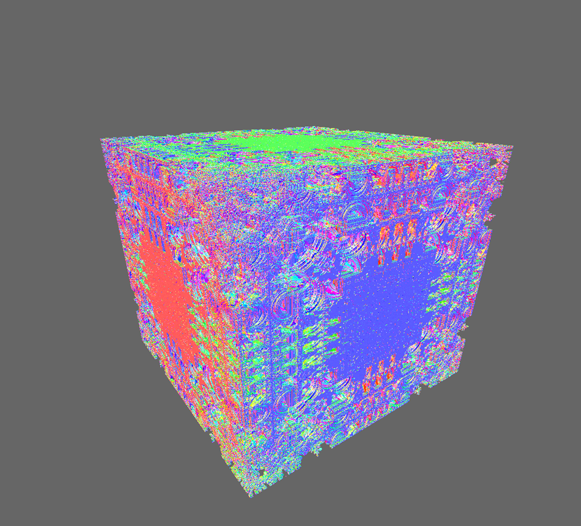

## Introduction

The goal of this project was to use parallel computing to efficiently produce images of a mandelbox, a type of 3-dimensional fractal, in order to create a video traversing through the shape. We needed to make a 4-minute video with a resolution of 1080p at 30 frames per second, i.e. 7200 frames stitched together.

[](https://youtu.be/fXGytJTkRyk).

##Method of Parallelization

###Overview

**openMP**: The computation of each frame is performed on a single CPU over all of its available cores. These CPUs are responsible for coloring 1/P pixels in the final image. This process involves marching a ray from the camera until it intersects with the box, then the normal with the surface is calculated by marching additional rays, and then the color of the pixel is calculated using the normal.

**Parallel Path Algorithm**: The challenge with parallelizing the path over multiple computers is that the camera parameters have to be computed sequentially. This means that the path generation must be computed serially. The process was sped up drastically by creating a different render function for the purpose of retrieving pathing data. This function only renders at a resolution of 25x25 pixels, and the color is not calculated, nor is the image array used at all. This process is still run using openMP, so it is serial in that it is not distributed to multiple computers (sockets). This results in computation time of the path generation to have a linear relation to the number of frames being generated and independent of the output resolution. The results are that 10,000 camera parameters can be generated in ~2 minutes.

**MPI**: The frames are distributed evenly to McMaster’s server sockets, so that each of their CPUs (2 for most servers) is computing an individual frame. This was found to have a 30% performance increase over having each server working on its own frame (likely due to the relatively slow bus speed from CPU to CPU). Once the path is generated, an array of length # frames containing camera params is broadcast to all of the CPU sockets and they begin computing their regions. Because the school servers have an NFS server that contains all user data, the rendered frames do not need to be retrieved over MPI, they can just be saved to disk.

**OpenACC**: OpenACC is significantly faster than OpenMP, and could have be used for the same purpose. We attempted to use OpenACC in place of OpenMP, however we encountered numerous errors ranging from problems with the outdated C++ compiler running on CAS servers, to parallelization issues due to the types of data structures used. After weeks of debugging, it was ultimately in our best interest to abandon work on OpenACC and focus on improving our OpenMP implementation to have something to submit by the due date. [See our progress with OpenACC](https://github.com/goatandsheep/mandelboxes/tree/rakesh-openCC).

###Pathing Algorithm

Movement Direction: Move towards a point that is a combination between the furthest visible point and the past preferred point. The error between the new and old point is used to calculate the amount that the camera will turn (only a fraction of a turn per frame). A new preferred point is calculated by using a complementary filter:

	(0.9 * old) + (0.1 * new)

**Movement Speed**: A maximum speed is set, but the camera can slow when an object comes within a certain threshold of its center view. When its view is clear the camera accelerates forward.

**Bumping**: When an object is within a certain threshold, the camera will move in the reverse direction. This effectively eliminates any chance of collision.

**Flipping**: When the camera comes far too close to an object, its direction vector is inverted and it begins moving in the opposite direction. This does not happen in the final path code but it was left in.

In order to produce our video, we had to generate 10,000 different frames that followed some sort of path through the mandelbox. This task seemed simple at first, but turned out to be much more difficult than we initially expected.

The first challenge was figuring out how to create a “path” through the mandelbox that didn’t have any collisions with the surface of the mandelbox. We decided the best approach would be algorithmic, as opposed to doing trial-and-error to create a hard-coded path. We devised an algorithm that generates a path according to a weighted choice like so (in simplified pseudocode below, or in the function “generateCameraPath” in the file “renderer.cc”):

```python
for each frame:
  determine distance between current point and mandelbox surface
  if max distance is lower than threshold:
    heavily weight opposite direction
  otherwise:
    the weight is normal
  bump the camera up or down slightly based on the weighted choice
  move the camera forward slightly based on the weighted choice
```

On each iteration of the above loop, the camera parameters were stored in an array. Once complete, this array was broadcast to all threads, who would then start rendering frames based on camera parameters in the array. 

##Experiments

One problem that we ran into was with reducing the amount of disk space our frames were taking on the server. To combat that, we proposed taking advantage of the shared disk across the multiple servers.

1. Save the frame to disk.
2. Use MPI to tell another server to
	1. wait for the frame to show up in disk
	2. Stream it into ffmpeg
	3. Delete the frame

Unfortunately, we couldn’t figure out how to stream the frames into ffmpeg, so we dropped that idea.

We tried experimenting with jpg because we were concerned with the time it would take to compute and the disk space footprint. However, we realized that it was unnecessary because we have a lot of disk space. It may also result in lossy compression if we did it wrong. It would also take a lot of extra time to compress bitmap to jpeg, then unpack jpeg again before repacking it as an mpeg. It would also require us to use the libraries behind ImageMagik instead of being able to use the software, itself. Lastly, we mistook the colour scheme of JPEG, YCbCr, with YUV.

##Mandelboxes vs Mandelbulbs

Mandelboxes take longer to compute than mandelbulbs because mandelbulbs often require a much lower number of iterations than their box versions in order to have intricate detail. Mandelboxes can have between 2 to 8 times more iterations than a mandelbulb requires. Mandelbulbs also compute their shape radially using spherical coordinates, whereas mandelboxes fold into themselves if they leave their shape. This results in a much deeper internal complex structure as opposed to the external growth of more bulbs on the exterior of the shape. In addition from our experience mandelboxes were also slower because they could be traversed from within. Once inside this object, very few rays escape, resulting in more pixels that had to be calculated and coloured accordingly.

##Setup

###Required software

* OpenMP
* pgCC
* Unix operating system (i.e. Mac OS X or Linux)
* [FFmpeg](https://www.ffmpeg.org/)
* [OpenACC](http://www.openacc.org/)

###Running

Once you have our code and the required software, you can reproduce our final result by doing the following:

1. ssh into `mpihost01.mcmaster.ca`
2. cd into the directory containing our code
3. `make clean`
4. `make mpi`
5. `./mandelbox`
6. `make video`


